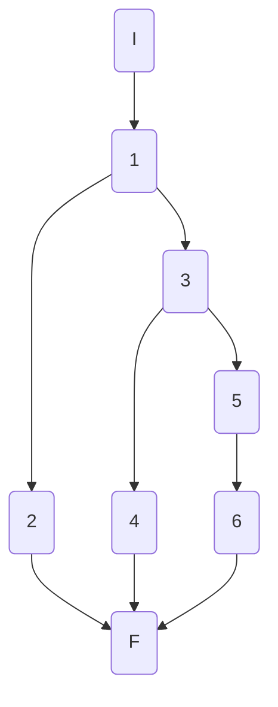

## AthletesController.GetAthletesAsync

### Código

```csharp
[HttpGet]
public async Task<ActionResult<IEnumerable<ShortAthleteModel>>> GetAthletesAsync(int disciplineId)
{
    try
    {
        var athletes = await _athleteService.GetAthletesAsync(disciplineId);//1
        return Ok(athletes);//2
    }
    catch (NotFoundElementException ex)//3
    {
        return NotFound(ex.Message);//4
    }
    catch (Exception)//5
    {
        return StatusCode(StatusCodes.Status500InternalServerError, "Something happened.");//6
    }
}
```

### Grafo



### Complejidad ciclo matica

Numero de regiones
$$
v(G) = R \\
v(G) = 3
$$

Numero de nodos y aristas
$$
v(G) = E - N + 2 \\
v(G) = 9 - 8 + 2
$$
  
Numero de decisiones
$$
v(G) = P + 1 \\
v(G) = 2 + 1
$$

### Casos de prueba

| | Camino   | Entrada   | TC | Salida  |
| --- | --- | --- | --- | --- |
| 1 | I 1 3 5 6 F | `disciplineId` valid or invalid,  | `disciplineId = 87` | `Status Code: 500` |
| 2 | I 1 3 4 F | `disciplineId` invalid,  | `disciplineId = 87` | `Status Code: 404` |
| 3 | I 1 2 F | `disciplineId` valid,  | `disciplineId = 1` | `Status Code: 200` `[{},{},...]` |

### Pruebas unitarias

```csharp
//tc1
```

```csharp
//tc2
```